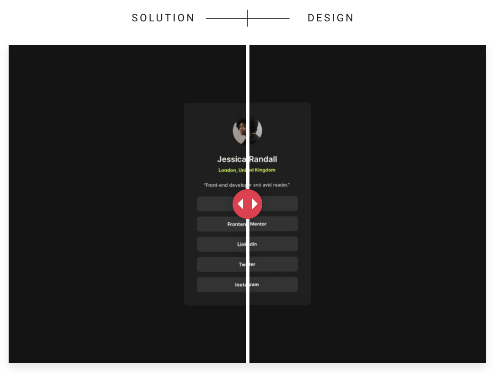

# Frontend Mentor - Social links profile solution

This is a solution to the [Social links profile challenge on Frontend Mentor](https://www.frontendmentor.io/challenges/social-links-profile-UG32l9m6dQ). Frontend Mentor challenges help you improve your coding skills by building realistic projects.

## Table of contents

- [Overview](#overview)
  - [The challenge](#the-challenge)
  - [Screenshot](#screenshot)
  - [Links](#links)
- [Author](#author)
- [Acknowledgments](#acknowledgments)

**Note: Delete this note and update the table of contents based on what sections you keep.**

## Overview

### The challenge

Users should be able to:

- See hover and focus states for all interactive elements on the page

### Screenshot



### Links

- Solution URL: [Solution URL here](https://github.com/chelsea-here/social-links-profile)
- Live Site URL: [Live site url](https://social-links-profile-chi-two.vercel.app/)

## My process

### Built with

- Semantic HTML5 markup
- CSS custom properties
- Flexbox
- CSS Grid
- Mobile-first workflow
- [React](https://reactjs.org/) - JS library
- [Next.js](https://nextjs.org/) - React framework
- [Tailwind CSS](https://tailwindcss.com/) - CSS framework

## Author

- Website - [My Github](https://github.com/chelsea-here)
- Frontend Mentor - [@chelsea-here](https://www.frontendmentor.io/profile/chelsea-here)

## Acknowledgments

Thank you too all those who have taken their time to provide free resources. Special thanks to contributors at freecodecamp.org for helping me get started!

## End

```

```
